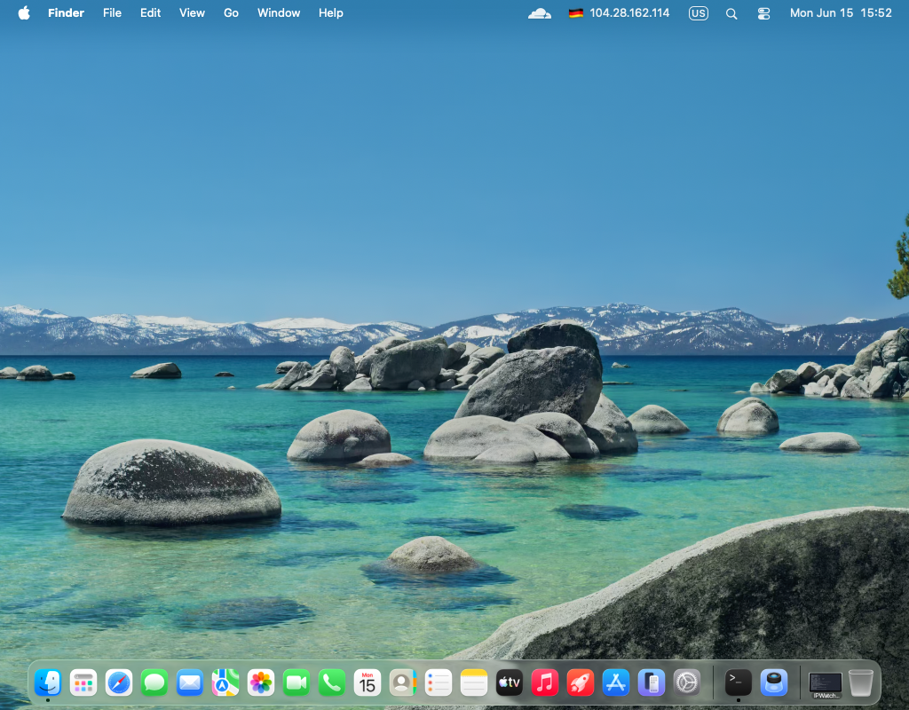

# IPWatcher



macOS menu bar app that monitors your public IP address.

## What it does

- Shows current IP with the country flag in the menu bar (e.g. 🇩🇪 1.2.3.4)
- Sends a notification when IP changes, showing both old and new flag + IP
- Keeps a history of up to 50 IP changes accessible via the History submenu
- Falls back to 🌐 if country cannot be determined
- Runs silently in the background with no Dock icon

## Menu

| Item | Description |
|---|---|
| Settings… | Set target IP and check interval |
| Check now | Force an immediate check |
| History | Log of all IP changes with timestamps |
| Quit | Stop the app |

## Install

```bash
git clone https://github.com/medgimet/IPWatcher.git
cd IPWatcher
swift build -c release
.build/release/IPWatcher &
```

On first launch a settings window will appear — enter your target IP and check interval.

## Data

History is stored in `~/Library/Application Support/IPWatcher/history.json`.
